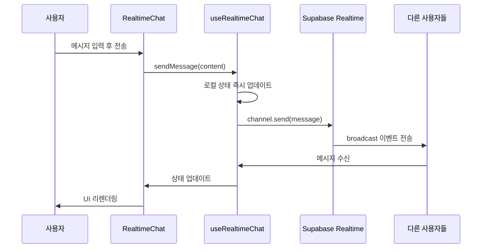

# 🚀 AI Voice Chat - Supabase Realtime Chat Implementation

Next.js와 Supabase Realtime을 사용한 실시간 채팅 시스템 구현

## 📁 프로젝트 구조

```
src/
├── app/
│   ├── chat/
│   │   └── ai-streamer/
│   │       └── page.tsx          # 채팅 페이지
│   ├── globals.css               # 전역 CSS 및 디자인 토큰
│   └── layout.tsx
├── components/
│   ├── chat/
│   │   ├── chat-message.tsx      # 개별 채팅 메시지 컴포넌트
│   │   └── realtime-chat.tsx     # 메인 실시간 채팅 컴포넌트
│   └── ui/
│       ├── button.tsx            # 재사용 가능한 버튼 컴포넌트
│       └── input.tsx             # 재사용 가능한 입력 컴포넌트
├── hooks/
│   └── chat/
│       ├── use-chat-scroll.tsx   # 채팅 자동 스크롤 훅
│       └── use-realtime-chat.tsx # Supabase Realtime 채팅 훅
└── lib/
    ├── supabase/
    │   └── client.ts             # Supabase 클라이언트 설정
    └── utils.ts                  # 유틸리티 함수 (cn 등)
```

## 🔧 기술 스택

- **Frontend**: Next.js 13+ (App Router)
- **Styling**: Tailwind CSS with CSS Variables
- **Realtime**: Supabase Realtime (Broadcast)
- **Database**: Supabase PostgreSQL
- **TypeScript**: 완전한 타입 안전성
- **UI**: Radix UI 스타일의 컴포넌트

## 🏗️ 구현 아키텍처

### 1. 핵심 훅: `use-realtime-chat.tsx`

**Supabase Realtime 채널 관리 및 메시지 송수신**

```typescript
interface UseRealtimeChatProps {
  roomName: string    // 채팅방 이름 (고유 식별자)
  username: string    // 사용자 이름
}

export interface ChatMessage {
  id: string          // 메시지 고유 ID
  content: string     // 메시지 내용
  user: {
    name: string      // 사용자 이름
  }
  createdAt: string   // 생성 시간 (ISO 문자열)
}
```

**주요 기능:**
- ✅ **채널 구독**: `supabase.channel(roomName)`으로 실시간 채널 생성
- ✅ **메시지 수신**: `broadcast` 이벤트 리스너로 실시간 메시지 수신
- ✅ **메시지 전송**: `channel.send()`로 다른 사용자에게 메시지 브로드캐스트
- ✅ **연결 상태 관리**: 채널 구독 상태 추적
- ✅ **메모리 정리**: 컴포넌트 언마운트 시 채널 정리

### 2. 자동 스크롤: `use-chat-scroll.tsx`

**채팅 컨테이너 자동 스크롤 관리**

```typescript
export function useChatScroll() {
  const containerRef = useRef<HTMLDivElement>(null)
  
  const scrollToBottom = useCallback(() => {
    if (!containerRef.current) return
    
    const container = containerRef.current
    container.scrollTo({
      top: container.scrollHeight,
      behavior: 'smooth',    // 부드러운 스크롤
    })
  }, [])

  return { containerRef, scrollToBottom }
}
```

**주요 기능:**
- ✅ **자동 스크롤**: 새 메시지 도착 시 자동으로 하단 스크롤
- ✅ **부드러운 애니메이션**: `behavior: 'smooth'`로 자연스러운 스크롤
- ✅ **참조 관리**: `useRef`로 DOM 요소 직접 접근

### 3. 메시지 컴포넌트: `chat-message.tsx`

**개별 채팅 메시지 UI 렌더링**

```typescript
interface ChatMessageItemProps {
  message: ChatMessage     // 메시지 데이터
  isOwnMessage: boolean    // 본인 메시지 여부
  showHeader: boolean      // 헤더(이름/시간) 표시 여부
}
```

**주요 기능:**
- ✅ **메시지 정렬**: 본인 메시지는 우측, 상대방 메시지는 좌측
- ✅ **조건부 헤더**: 연속된 메시지의 마지막에만 사용자 정보 표시
- ✅ **반응형 디자인**: 최대 너비 75%로 모바일 친화적
- ✅ **색상 구분**: 본인/상대방 메시지 색상 차별화

### 4. 메인 채팅 컴포넌트: `realtime-chat.tsx`

**전체 채팅 인터페이스 통합 관리**

```typescript
interface RealtimeChatProps {
  roomName: string                              // 채팅방 이름
  username: string                              // 사용자 이름
  onMessage?: (messages: ChatMessage[]) => void // 메시지 콜백 (DB 저장용)
  messages?: ChatMessage[]                      // 초기 메시지 (DB에서 로드)
}
```

**주요 기능:**
- ✅ **메시지 병합**: 실시간 메시지 + 초기 메시지 통합
- ✅ **중복 제거**: 메시지 ID 기반 중복 메시지 제거
- ✅ **시간순 정렬**: `createdAt` 기준 메시지 정렬
- ✅ **헤더 로직**: 연속 메시지에서 마지막에만 헤더 표시
- ✅ **입력 상태 관리**: 연결 상태에 따른 입력 필드 활성화
- ✅ **애니메이션**: 새 메시지 등장 시 페이드인 효과

## 🎨 디자인 시스템

### CSS 변수 (Design Tokens)

```css
:root {
  --background: 0 0% 100%;              /* 배경색 */
  --foreground: 222.2 84% 4.9%;         /* 기본 텍스트 */
  --muted: 210 40% 98%;                 /* 비활성 배경 */
  --muted-foreground: 215.4 16.3% 46.9%; /* 비활성 텍스트 */
  --border: 214.3 31.8% 91.4%;          /* 테두리 */
  --primary: 222.2 47.4% 11.2%;         /* 주 색상 */
  --primary-foreground: 210 40% 98%;    /* 주 텍스트 */
}
```

### 애니메이션

```css
/* 메시지 등장 애니메이션 */
.animate-in.fade-in.slide-in-from-bottom-4

/* 버튼 등장 애니메이션 */
.animate-in.fade-in.slide-in-from-right-4
```

## 🔄 메시지 흐름

### 1. 메시지 전송 과정



### 2. 메시지 헤더 표시 로직

```typescript
// 연속된 메시지에서 마지막에만 헤더 표시
{allMessages.map((message, index) => {
  const nextMessage = index < allMessages.length - 1 ? allMessages[index + 1] : null
  const showHeader = !nextMessage || nextMessage.user.name !== message.user.name
  
  return (
    <ChatMessageItem
      message={message}
      isOwnMessage={message.user.name === username}
      showHeader={showHeader}  // 마지막 메시지에만 true
    />
  )
})}
```

**예시:**
```
[사용자A] 안녕하세요
[사용자A] 반갑습니다
[사용자A] 잘 부탁드려요  ← 사용자A, 12:34 PM (헤더 표시)

[사용자B] 네 반갑습니다  ← 사용자B, 12:35 PM (헤더 표시)
```

## 🚀 사용 방법

### 1. 기본 사용법

```tsx
import { RealtimeChat } from '@/components/chat/realtime-chat'

export default function ChatPage() {
  return (
    <div className="h-screen">
      <RealtimeChat
        roomName="general"
        username="사용자이름"
      />
    </div>
  )
}
```

### 2. 데이터베이스 연동

```tsx
export default function ChatPage() {
  const [messages, setMessages] = useState<ChatMessage[]>([])

  return (
    <RealtimeChat
      roomName="general"
      username="사용자이름"
      messages={messages}              // DB에서 로드된 초기 메시지
      onMessage={(msgs) => {           // 새 메시지 DB 저장
        console.log('New messages:', msgs)
        // DB 저장 로직
      }}
    />
  )
}
```

## 🔒 보안 고려사항

- ✅ **클라이언트 사이드 실시간**: 브라우저 간 직접 통신 (서버 저장 없음)
- ✅ **채널 격리**: `roomName`으로 채팅방 완전 분리
- ✅ **사용자 식별**: `username`으로 메시지 발신자 구분
- ⚠️ **인증 필요**: 실제 서비스에서는 Supabase Auth 연동 권장

## 🛠️ 확장 가능성

### 1. 데이터베이스 저장
- Supabase PostgreSQL 테이블에 메시지 영구 저장
- Row Level Security (RLS)로 접근 권한 관리

### 2. 사용자 인증
- Supabase Auth로 로그인/회원가입
- 사용자 프로필 및 권한 관리

### 3. 추가 기능
- 파일/이미지 첨부
- 이모지 반응
- 읽음 상태 표시
- 사용자 온라인 상태
- 음성 메시지 (AI TTS 연동)

## 📋 TODO - 음성 AI 통합 계획

- [ ] ElevenLabs API 연동
- [ ] Text-to-Speech 시스템
- [ ] AI 응답 자동 생성
- [ ] 실시간 음성 스트리밍
- [ ] 음성 메시지 재생 UI

---

이 실시간 채팅 시스템은 **Supabase Realtime의 Broadcast 기능**을 활용하여 서버 없이도 완전한 실시간 채팅을 구현한 솔루션입니다. 